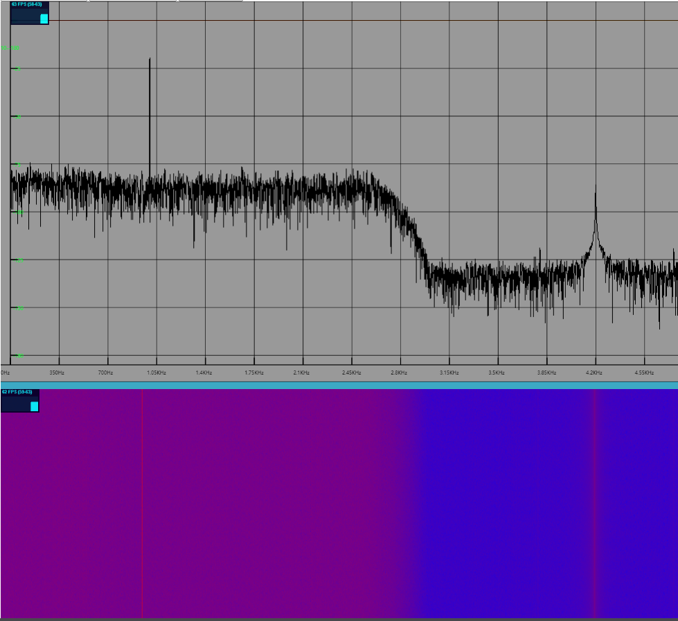

# Signal Chart

基于 ThreeJS 的信号图形库

## 功能

> 频谱图

- [√] 频谱显示
- [√] 滚轮、拖拽操作图谱
- [√] 归一化标尺
- 鼠标标尺
- marker 及相关操作

> 语图

> 二维语图

- [√] 语图展示
- [√] 色谱自定义
- 绘制方向控制
- 边缘标尺
- 鼠标标尺
- 鼠标位置取值

> 三维语图

- [√] 语图展示
- [√] 色谱自定义
- 三维标尺
- 鼠标标尺
- 鼠标位置取值

> 时域图(波形图)

- [√] 波形显示
- [√] 横纵轴、数据取点
- 滚轮、拖拽操作图谱
- 归一化标尺
- 鼠标标尺
- marker 及相关操作

## 用法

### 1. 频谱图

下载`lib/signal-chart.js`添加到项目，或在 node_modules 目录拉取本项目

```js
import { Spectrum } from 'signal-chart.js'
const gram = new Spectrum({
  El: document.body, //必填：挂载节点
  Performance: false, //可选： 是否打开性能监视窗口
  fftLen: 4800, //可选 ： FFT数组长度，默认4800，能够根据传入数据自动调整
  HORIZONTAL_AXIS_MARGIN: 50, //可选 ： 默认50px
  VERTICAL_AXIS_MARGIN: 50, //可选:默认50px
  keepMode: KeepMode.CLEAN, //可选：默认刷新模式
  cacheCount: 500, //可选：默认500帧
  color: {
    //可选
    grid: '#555555', // 可选 背景网格颜色
    background: '#000000', //可选 背景色
    axis: '#FFFFFF', // 可选 轴色
    label: '#FFFFFF', // 可选 轴标签色
    line: '#3ed630', // 可选 折线色
  },
})

//设置当前图谱的频率范围(表示值)
gram.setFreqRange(1000, 32000)
//设置可视区域的范围（Hz）,展示1.5KHz 到 32Khz
gram.setViewFreqRange(1500, 32000)
//设置电平显示范围（dBm）
gram.setViewLevelRange(-120, -20)
//更新图谱数据（FFT频谱 Float32Array 格式，每次update一帧）
gram.update(data)

//                        Marker 功能
// 添加marker
// 传入频点，或marker参数，返回marker名称
addMarker(marker: number | Marker): string
//
const markerName = gram.addMarker(1000) //将marker添加到1000Hz
const markerName = gram.addMarker({
  freq: 1000 //频率 Hz
  level: -50 // 设置电平dBm 可选，如果设置，则会强制绘制到此处
  name: "mark1" // marker 名称 可选,如果不设置，则会按照计数器增加 eg: marker1
})

// 调整marker
setMarker(markerName: string, freq: number, level?: number)
gram.setMarker("marker1",4000) //调整marker1 到4kHz
gram.setMarker("marker1",1000,-20) // 调整marker1 到4kHz并绘制到-20dBm
//


// 获取Marker
getMarker(name: string): Marker
getMarkers(): Map<string, Marker>

//移除marker,如果没有参数，则移除所有marker
removeMarker(...markerName: string[])
gram.removeMarker("marker1",'marker2')
gram.removeMarker() //如果没有参数，则移除所有marker

```

### 2. 语图

下载`lib/signal-chart.js`添加到项目，或在 node_modules 目录拉取本项目

```js
import { Spectrogram } from 'signal-chart.js'
const gram = new Spectrogram({
  Performance: true, // 是否打开性能监视窗口
  El: document.getElementById('cont2'), // 图形绘制节点
  /** 频谱图方向 */
  direction: SpectrogramDirection.UP
  /** 频频图类型：2D 3D  */
  type: SpectrogramType.Plane
  /** 色 */
  color: {
    /** 图色谱 颜色字符串 如 #FFFFFF,#000000,'red' */
    front: ['blue', 'red'],
    /** 背景色 */
     background: '#11FFFF',
    /** 轴色 */
    axis: 'white',
    /** 轴标签色 */
    label: '#FFFFFFF',
  }
  //每帧点数
  fftLen: 9600
  /** 缓存帧数 */
  cacheCount: 500
})
//设置当前图谱的频率范围(表示值)
gram.setFreqRange(1000, 32000)
//设置可视区域的范围（Hz）,展示1.5KHz 到 32Khz
gram.setViewFreqRange(1500, 32000)
//设置电平显示范围,影响色谱取值（dBm）
gram.setViewLevelRange(-120, -20)
//更新图谱数据（FFT频谱 Float32Array 格式，每次update一帧）
gram.update({time: new Date().getTime(),data:data})
```

### 3.连接器

链接器目前可以链接图像间的频率范围变化、显示频率范围变化、显示电平区域变化

```js
import { ConnectorGroup } from 'signal-chart.js'
/** 构建连接器 ，同时传入需要链接的图像 */
const connector = new ConnectorGroup(gram, gram2)
connector.stop() //暂时停止链接
connector.start() // 恢复链接
connector.disconnect(gram) // 断开gram图像的连接
```

## 展示

### 频谱、语图

`example/threejs.html`

